``` r
library(lme4)
library(tidyverse)
library(GGally)
library(lattice)
library(lmerTest) 
library(ggeffects)
library(sjPlot)
library(cowplot)

#read in data
funguild <- read_tsv("transformed_ASVfunguildtable.guilds.txt")
metadata <- read_tsv("panama_metadata_full_v1.txt")
ASV_tab_rar <- read_tsv("PanamaPrecip_ITS_ASVs_r10574.txt")

ASV_tab_rar <- ASV_tab_rar %>% rename(OTU_ID = X)
funguild <- funguild %>% rename(OTU_ID = otuID)

#merge ASV table and funguild output
ASV_guild <- left_join(ASV_tab_rar, funguild, by = "OTU_ID")
ASV_guild <- ASV_guild %>% relocate(where(is.character), .after = Species)

#get ASVs from just the 3 guilds of interest
sapro <- subset(ASV_guild, grepl("Saprotroph", ASV_guild$Guild))
patho <- subset(ASV_guild, grepl("Plant Pathogen", ASV_guild$Guild))
amf <- subset(ASV_guild, grepl("Arbuscular", ASV_guild$Guild))

#just to make this easier to look at/work with for now
meta_sub <- subset(metadata, select = c("Sample_ID", "Plot", "pH.water", "ResinP.mg_kg", "MAP", "Latitude", "Longitude"))
```

#### Look at distributions of predictors of interest

``` r
#look at distributions of predictors of interest
par(mfrow = c(2,2))
hist(meta_sub$ResinP.mg_kg, main = "Histogram of resin P", xlab = NULL)
hist(log(meta_sub$ResinP.mg_kg), main = "Histogram of log(resin P)", xlab = NULL)
hist(meta_sub$pH.water, main = "Histogram of pH.water", xlab = NULL)
hist(meta_sub$MAP, main = "Histogram of MAP", xlab = NULL)
```

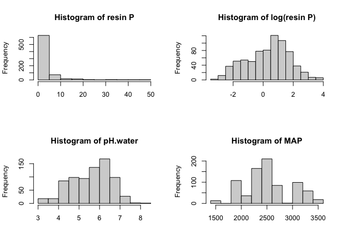

``` r
#log transform resin P
meta_sub$logP <- log(meta_sub$ResinP.mg_kg + .01)
```

#### Get guild counts and merge with metadata

``` r
#Get total AMF counts per sample
amf_counts <- as.data.frame(t(amf[,18:363]))
amf_counts$AMF <- rowSums(amf_counts)
amf_counts$Sample_ID <- rownames(amf_counts)
amf_counts <- subset(amf_counts, select = c(Sample_ID, AMF))
amf_counts$Sample_ID <- gsub("\\.", "_", amf_counts$Sample_ID)

#Get total pathogen counts per sample
patho_counts <- as.data.frame(t(patho[,18:363]))
patho_counts$Pathogens <- rowSums(patho_counts)
patho_counts$Sample_ID <- rownames(patho_counts)
patho_counts <- subset(patho_counts, select = c(Sample_ID, Pathogens))
patho_counts$Sample_ID <- gsub("\\.", "_", patho_counts$Sample_ID)

#Get total saprotroph counts per sample
sapro_counts <- as.data.frame(t(sapro[,18:363]))
sapro_counts$Saprotrophs <- rowSums(sapro_counts)
sapro_counts$Sample_ID <- rownames(sapro_counts)
sapro_counts <- subset(sapro_counts, select = c(Sample_ID, Saprotrophs))
sapro_counts$Sample_ID <- gsub("\\.", "_", sapro_counts$Sample_ID)

# Merge with metadata
meta_counts <- left_join(sapro_counts, meta_sub, by = "Sample_ID")
meta_counts <- left_join(amf_counts, meta_counts, by = "Sample_ID")
meta_counts <- left_join(patho_counts, meta_counts,  by = "Sample_ID")
```

#### Look at response distributions and transform as needed

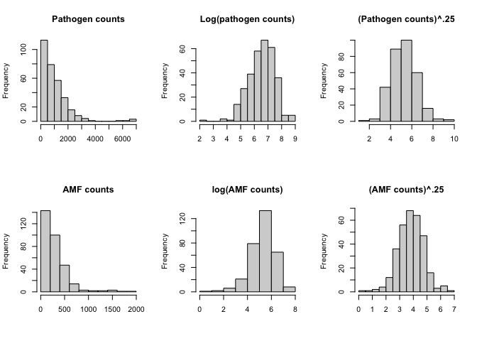

Proceed with 4th root-transformed pathogen and AMF counts and
untransformed saprotroph counts.

### Scatterplot matrix to look at distributions and correlations between variables

``` r
#with GGally
ggpairs(meta_counts_rmna, columns = c("logP", "pH.water", 
    "MAP", "Latitude", "Longitude", "AMF_trans", "Pathogens_trans", "Saprotrophs"), 
    title = "Scatterplot matrix for predictor and response variables of interest 
    (transformed where necessary)")
```

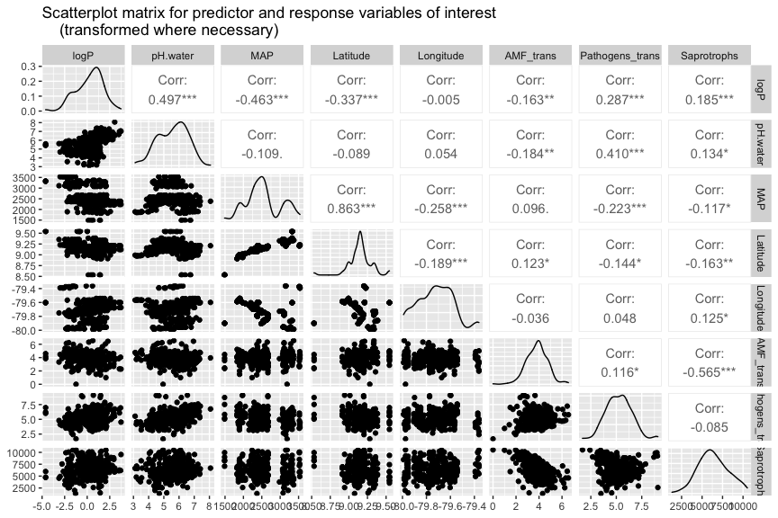

``` r
#collinearity correlation cutoff?
#one paper says >0.7, others say .8 or even .5
#will go ahead and use all predictors of interest
```

### Hierarchical mixed models with lme4

#### Look at whether random effects term improves fit

``` r
basic_mem_path <- lmer(Pathogens ~ logP + pH.water + log(MAP) + (1 | Plot), data = meta_counts_rmna)
basic_lm_path <- lm(Pathogens ~ logP + pH.water + log(MAP), data = meta_counts_rmna)
anova(basic_mem_path, basic_lm_path)
```

    ## Data: meta_counts_rmna
    ## Models:
    ## basic_lm_path: Pathogens ~ logP + pH.water + log(MAP)
    ## basic_mem_path: Pathogens ~ logP + pH.water + log(MAP) + (1 | Plot)
    ##                npar    AIC    BIC  logLik deviance  Chisq Df Pr(>Chisq)    
    ## basic_lm_path     5 5218.7 5237.5 -2604.3   5208.7                         
    ## basic_mem_path    6 5208.0 5230.6 -2598.0   5196.0 12.681  1  0.0003694 ***
    ## ---
    ## Signif. codes:  0 '***' 0.001 '**' 0.01 '*' 0.05 '.' 0.1 ' ' 1

``` r
# it does --> lower AIC, sig p-val

basic_mem_amf <- lmer(AMF_trans ~ logP + pH.water + log(MAP) + (1 | Plot), data = meta_counts_rmna)
basic_lm_amf <- lm(AMF_trans ~ logP + pH.water + log(MAP), data = meta_counts_rmna)
anova(basic_mem_amf, basic_lm_amf)
```

    ## Data: meta_counts_rmna
    ## Models:
    ## basic_lm_amf: AMF_trans ~ logP + pH.water + log(MAP)
    ## basic_mem_amf: AMF_trans ~ logP + pH.water + log(MAP) + (1 | Plot)
    ##               npar    AIC    BIC  logLik deviance  Chisq Df Pr(>Chisq)    
    ## basic_lm_amf     5 837.93 856.71 -413.96   827.93                         
    ## basic_mem_amf    6 818.92 841.46 -403.46   806.92 21.006  1  4.579e-06 ***
    ## ---
    ## Signif. codes:  0 '***' 0.001 '**' 0.01 '*' 0.05 '.' 0.1 ' ' 1

``` r
#again, re plot term improves fit

basic_mem_sap <- lmer(Saprotrophs ~ logP + pH.water + log(MAP) + (1 | Plot), data = meta_counts_rmna)
basic_lm_sap <- lm(Saprotrophs ~ logP + pH.water + log(MAP), data = meta_counts_rmna)
anova(basic_mem_sap, basic_lm_sap)
```

    ## Data: meta_counts_rmna
    ## Models:
    ## basic_lm_sap: Saprotrophs ~ logP + pH.water + log(MAP)
    ## basic_mem_sap: Saprotrophs ~ logP + pH.water + log(MAP) + (1 | Plot)
    ##               npar    AIC    BIC  logLik deviance  Chisq Df Pr(>Chisq)    
    ## basic_lm_sap     5 5641.9 5660.7 -2816.0   5631.9                         
    ## basic_mem_sap    6 5628.8 5651.3 -2808.4   5616.8 15.176  1  9.792e-05 ***
    ## ---
    ## Signif. codes:  0 '***' 0.001 '**' 0.01 '*' 0.05 '.' 0.1 ' ' 1

``` r
#definitely include plot re terms
```

#### Model selection with lmerTest

``` r
#use step function from lmerTest package to select best fit model
#need to rescale MAP with log transform

## AMF
full_mem_AMF <- lmer(AMF_trans ~ logP * pH.water * log(MAP) + (1 | Plot), data = meta_counts_rmna)
# anova(full_mem_AMF, type = 'I')
step(full_mem_AMF)
```

    ## Backward reduced random-effect table:
    ## 
    ##            Eliminated npar  logLik    AIC    LRT Df Pr(>Chisq)    
    ## <none>                  10 -406.85 833.70                         
    ## (1 | Plot)          0    9 -416.69 851.39 19.691  1  9.103e-06 ***
    ## ---
    ## Signif. codes:  0 '***' 0.001 '**' 0.01 '*' 0.05 '.' 0.1 ' ' 1
    ## 
    ## Backward reduced fixed-effect table:
    ## Degrees of freedom method: Satterthwaite 
    ## 
    ##                        Eliminated  Sum Sq Mean Sq NumDF   DenDF F value  Pr(>F)
    ## logP:pH.water:log(MAP)          1 1.82976 1.82976     1 300.242  2.8998 0.08963
    ## pH.water:log(MAP)               2 0.39012 0.39012     1 183.952  0.6181 0.43276
    ## logP:log(MAP)                   3 2.25413 2.25413     1 221.606  3.5698 0.06014
    ## log(MAP)                        4 1.35574 1.35574     1  54.912  2.1229 0.15080
    ## logP:pH.water                   5 1.94007 1.94007     1 248.848  3.0023 0.08439
    ## logP                            6 0.52601 0.52601     1 177.265  0.8186 0.36682
    ## pH.water                        7 2.15523 2.15523     1 181.998  3.3712 0.06798
    ##                         
    ## logP:pH.water:log(MAP) .
    ## pH.water:log(MAP)       
    ## logP:log(MAP)          .
    ## log(MAP)                
    ## logP:pH.water          .
    ## logP                    
    ## pH.water               .
    ## ---
    ## Signif. codes:  0 '***' 0.001 '**' 0.01 '*' 0.05 '.' 0.1 ' ' 1
    ## 
    ## Model found:
    ## AMF_trans ~ (1 | Plot)

``` r
step_mem_amf <- lmer(AMF_trans ~ logP + pH.water + log(MAP) + logP:pH.water + 
                       logP:log(MAP) + (1 | Plot), data = meta_counts_rmna)
summary(step_mem_amf)
```

    ## Linear mixed model fit by REML. t-tests use Satterthwaite's method [
    ## lmerModLmerTest]
    ## Formula: 
    ## AMF_trans ~ logP + pH.water + log(MAP) + logP:pH.water + logP:log(MAP) +  
    ##     (1 | Plot)
    ##    Data: meta_counts_rmna
    ## 
    ## REML criterion at convergence: 816.6
    ## 
    ## Scaled residuals: 
    ##     Min      1Q  Median      3Q     Max 
    ## -4.8034 -0.5698  0.0250  0.5294  2.9882 
    ## 
    ## Random effects:
    ##  Groups   Name        Variance Std.Dev.
    ##  Plot     (Intercept) 0.1968   0.4437  
    ##  Residual             0.6314   0.7946  
    ## Number of obs: 316, groups:  Plot, 56
    ## 
    ## Fixed effects:
    ##                Estimate Std. Error        df t value Pr(>|t|)  
    ## (Intercept)     0.23087    3.57061  56.70482   0.065   0.9487  
    ## logP           -4.00023    1.88287 224.04358  -2.125   0.0347 *
    ## pH.water       -0.14880    0.08104 180.88357  -1.836   0.0680 .
    ## log(MAP)        0.56719    0.46202  56.61043   1.228   0.2247  
    ## logP:pH.water   0.09761    0.04958 254.37335   1.969   0.0501 .
    ## logP:log(MAP)   0.43628    0.23091 221.60597   1.889   0.0601 .
    ## ---
    ## Signif. codes:  0 '***' 0.001 '**' 0.01 '*' 0.05 '.' 0.1 ' ' 1
    ## 
    ## Correlation of Fixed Effects:
    ##             (Intr) logP   pH.wtr l(MAP) lgP:H.
    ## logP        -0.132                            
    ## pH.water     0.055 -0.026                     
    ## log(MAP)    -0.993  0.127 -0.174              
    ## logP:pH.wtr  0.013 -0.261 -0.400  0.028       
    ## lgP:lg(MAP)  0.123 -0.989  0.072 -0.122  0.121

``` r
# diagnostic plots
rvf_amf <- plot(step_mem_amf) 
qq_amf <- qqmath(step_mem_amf) # from lattice 
plot_grid(rvf_amf, qq_amf)
```

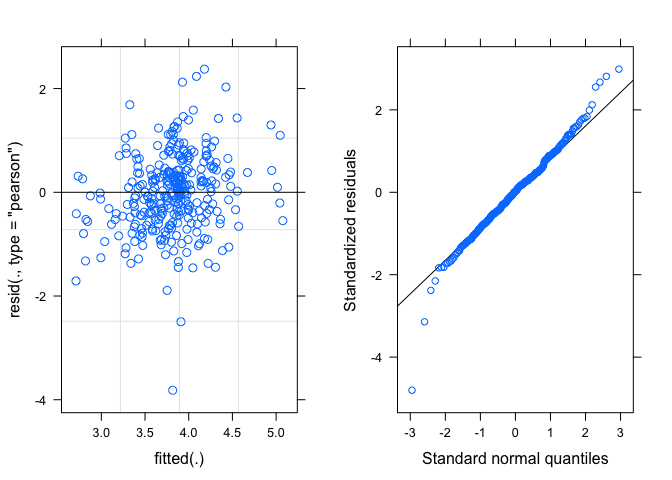

``` r
# plot predicted marginal effects based on model
pred_amf <- ggpredict(step_mem_amf, method = 're') #ggpredict from ggeffects library
plot(pred_amf, rawdata = T, facets = TRUE, show.x.title = FALSE, show.y.title = TRUE) +
  labs(title = "Predicted values of 4th root-transformed AMF counts", y = "4th root-transformed AMF counts")
```

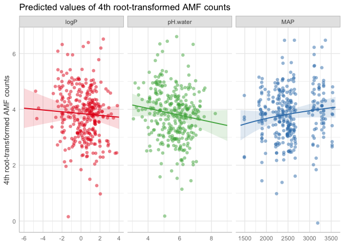

``` r
## Saprotrophs
full_mem_sap <- lmer(Saprotrophs ~ logP * pH.water * log(MAP) + (1 | Plot), data = meta_counts_rmna)
step(full_mem_sap)
```

    ## Backward reduced random-effect table:
    ## 
    ##            Eliminated npar  logLik    AIC    LRT Df Pr(>Chisq)    
    ## <none>                  10 -2754.1 5528.2                         
    ## (1 | Plot)          0    9 -2761.3 5540.6 14.389  1  0.0001486 ***
    ## ---
    ## Signif. codes:  0 '***' 0.001 '**' 0.01 '*' 0.05 '.' 0.1 ' ' 1
    ## 
    ## Backward reduced fixed-effect table:
    ## Degrees of freedom method: Satterthwaite 
    ## 
    ##                        Eliminated   Sum Sq  Mean Sq NumDF   DenDF F value
    ## logP:pH.water:log(MAP)          1   175066   175066     1 287.243  0.0644
    ## pH.water:log(MAP)               2  2289577  2289577     1 167.443  0.8454
    ## logP:pH.water                   3  3934245  3934245     1 234.568  1.4484
    ## pH.water                        4  2078273  2078273     1 173.487  0.7678
    ## logP:log(MAP)                   5  6773879  6773879     1 193.497  2.4955
    ## log(MAP)                        6  4521083  4521083     1  62.617  1.6635
    ## logP                            0 17859558 17859558     1 169.681  6.5119
    ##                        Pr(>F)  
    ## logP:pH.water:log(MAP) 0.7999  
    ## pH.water:log(MAP)      0.3592  
    ## logP:pH.water          0.2300  
    ## pH.water               0.3821  
    ## logP:log(MAP)          0.1158  
    ## log(MAP)               0.2019  
    ## logP                   0.0116 *
    ## ---
    ## Signif. codes:  0 '***' 0.001 '**' 0.01 '*' 0.05 '.' 0.1 ' ' 1
    ## 
    ## Model found:
    ## Saprotrophs ~ logP + (1 | Plot)

``` r
step_mem_sap <- lmer(Saprotrophs ~ logP + (1 | Plot), data = meta_counts_rmna)
summary(step_mem_sap)
```

    ## Linear mixed model fit by REML. t-tests use Satterthwaite's method [
    ## lmerModLmerTest]
    ## Formula: Saprotrophs ~ logP + (1 | Plot)
    ##    Data: meta_counts_rmna
    ## 
    ## REML criterion at convergence: 5597.4
    ## 
    ## Scaled residuals: 
    ##     Min      1Q  Median      3Q     Max 
    ## -3.0480 -0.6713 -0.1109  0.6678  2.7423 
    ## 
    ## Random effects:
    ##  Groups   Name        Variance Std.Dev.
    ##  Plot     (Intercept)  538976   734.1  
    ##  Residual             2742614  1656.1  
    ## Number of obs: 316, groups:  Plot, 56
    ## 
    ## Fixed effects:
    ##             Estimate Std. Error      df t value Pr(>|t|)    
    ## (Intercept)  6274.66     139.96   53.95  44.831   <2e-16 ***
    ## logP          198.80      77.90  169.68   2.552   0.0116 *  
    ## ---
    ## Signif. codes:  0 '***' 0.001 '**' 0.01 '*' 0.05 '.' 0.1 ' ' 1
    ## 
    ## Correlation of Fixed Effects:
    ##      (Intr)
    ## logP -0.161

``` r
rvf_sap <- plot(step_mem_sap) #looks ok
qq_sap <- qqmath(step_mem_sap) #looks ok
plot_grid(rvf_sap, qq_sap)
```

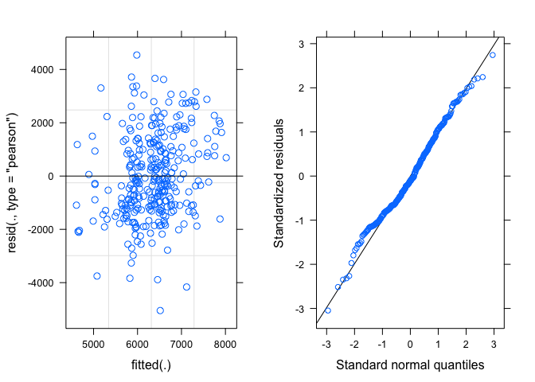

``` r
pred_sap <- ggpredict(step_mem_sap, method = 're') #ggpredict from ggeffects library
plot(pred_sap, rawdata = T, facets = TRUE, show.x.title = FALSE) +
  labs(title = "Predicted values of saprotroph counts", 
       y = "Saprotroph counts")
```

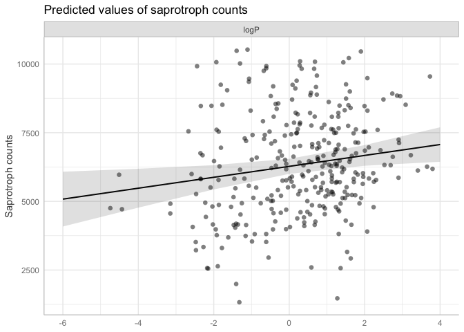

``` r
## Pathogens
full_mem_path <- lmer(Pathogens_trans ~ logP * pH.water * log(MAP) + (1 | Plot), data = meta_counts_rmna)
step(full_mem_path)
```

    ## Backward reduced random-effect table:
    ## 
    ##            Eliminated npar  logLik    AIC    LRT Df Pr(>Chisq)   
    ## <none>                  10 -470.81 961.63                        
    ## (1 | Plot)          0    9 -475.43 968.85 9.2266  1   0.002385 **
    ## ---
    ## Signif. codes:  0 '***' 0.001 '**' 0.01 '*' 0.05 '.' 0.1 ' ' 1
    ## 
    ## Backward reduced fixed-effect table:
    ## Degrees of freedom method: Satterthwaite 
    ## 
    ##                        Eliminated Sum Sq Mean Sq NumDF   DenDF F value
    ## logP:pH.water:log(MAP)          1  0.005   0.005     1 274.758  0.0046
    ## logP:pH.water                   2  0.036   0.036     1 214.050  0.0353
    ## logP:log(MAP)                   3  0.463   0.463     1 161.229  0.4614
    ## logP                            4  0.507   0.507     1 152.516  0.5052
    ## pH.water:log(MAP)               5  1.584   1.584     1 183.486  1.5797
    ## pH.water                        0 42.447  42.447     1 153.574 42.4634
    ## log(MAP)                        0  5.828   5.828     1  53.133  5.8303
    ##                           Pr(>F)    
    ## logP:pH.water:log(MAP)   0.94621    
    ## logP:pH.water            0.85110    
    ## logP:log(MAP)            0.49796    
    ## logP                     0.47830    
    ## pH.water:log(MAP)        0.21041    
    ## pH.water               9.763e-10 ***
    ## log(MAP)                 0.01923 *  
    ## ---
    ## Signif. codes:  0 '***' 0.001 '**' 0.01 '*' 0.05 '.' 0.1 ' ' 1
    ## 
    ## Model found:
    ## Pathogens_trans ~ pH.water + log(MAP) + (1 | Plot)

``` r
step_mem_path <- lmer(Pathogens_trans ~ pH.water + log(MAP) + (1 | Plot), data = meta_counts_rmna)
summary(step_mem_path)
```

    ## Linear mixed model fit by REML. t-tests use Satterthwaite's method [
    ## lmerModLmerTest]
    ## Formula: Pathogens_trans ~ pH.water + log(MAP) + (1 | Plot)
    ##    Data: meta_counts_rmna
    ## 
    ## REML criterion at convergence: 935.8
    ## 
    ## Scaled residuals: 
    ##     Min      1Q  Median      3Q     Max 
    ## -2.9524 -0.5896  0.0000  0.6273  3.4829 
    ## 
    ## Random effects:
    ##  Groups   Name        Variance Std.Dev.
    ##  Plot     (Intercept) 0.1659   0.4073  
    ##  Residual             0.9996   0.9998  
    ## Number of obs: 316, groups:  Plot, 56
    ## 
    ## Fixed effects:
    ##              Estimate Std. Error        df t value Pr(>|t|)    
    ## (Intercept)  10.94518    3.49408  54.96313   3.132  0.00278 ** 
    ## pH.water      0.47270    0.07254 153.57390   6.516 9.76e-10 ***
    ## log(MAP)     -1.05999    0.43899  53.13302  -2.415  0.01923 *  
    ## ---
    ## Signif. codes:  0 '***' 0.001 '**' 0.01 '*' 0.05 '.' 0.1 ' ' 1
    ## 
    ## Correlation of Fixed Effects:
    ##          (Intr) pH.wtr
    ## pH.water -0.208       
    ## log(MAP) -0.993  0.094

``` r
rvf_path <- plot(step_mem_path)
qq_path <- qqmath(step_mem_path)
plot_grid(rvf_path, qq_path)
```

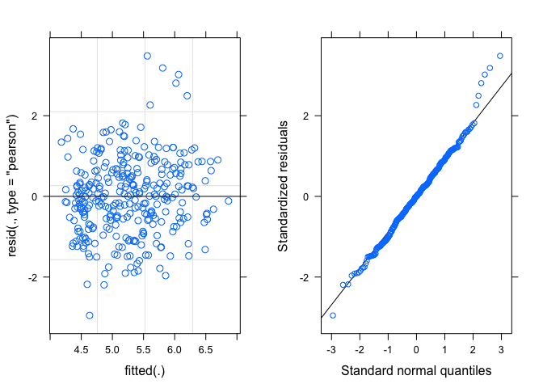

``` r
pred_path <- ggpredict(step_mem_path, method = 're') #ggpredict from ggeffects library
plot(pred_path, rawdata = T, facets = TRUE, show.x.title = FALSE) +
  labs(title = "Predicted values of 4th root-transformed pathogen counts", 
       y = "4th root-transformed pathogen counts")
```

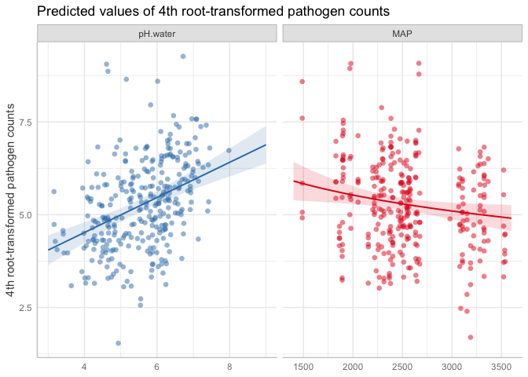

``` r
#regression table w/sjPlot
tab_model(step_mem_amf, step_mem_path, step_mem_sap)
```

<table style="border-collapse:collapse; border:none;">
<tr>
<th style="border-top: double; text-align:center; font-style:normal; font-weight:bold; padding:0.2cm;  text-align:left; ">
 
</th>
<th colspan="3" style="border-top: double; text-align:center; font-style:normal; font-weight:bold; padding:0.2cm; ">
AMF\_trans
</th>
<th colspan="3" style="border-top: double; text-align:center; font-style:normal; font-weight:bold; padding:0.2cm; ">
Pathogens\_trans
</th>
<th colspan="3" style="border-top: double; text-align:center; font-style:normal; font-weight:bold; padding:0.2cm; ">
Saprotrophs
</th>
</tr>
<tr>
<td style=" text-align:center; border-bottom:1px solid; font-style:italic; font-weight:normal;  text-align:left; ">
Predictors
</td>
<td style=" text-align:center; border-bottom:1px solid; font-style:italic; font-weight:normal;  ">
Estimates
</td>
<td style=" text-align:center; border-bottom:1px solid; font-style:italic; font-weight:normal;  ">
CI
</td>
<td style=" text-align:center; border-bottom:1px solid; font-style:italic; font-weight:normal;  ">
p
</td>
<td style=" text-align:center; border-bottom:1px solid; font-style:italic; font-weight:normal;  ">
Estimates
</td>
<td style=" text-align:center; border-bottom:1px solid; font-style:italic; font-weight:normal;  ">
CI
</td>
<td style=" text-align:center; border-bottom:1px solid; font-style:italic; font-weight:normal;  col7">
p
</td>
<td style=" text-align:center; border-bottom:1px solid; font-style:italic; font-weight:normal;  col8">
Estimates
</td>
<td style=" text-align:center; border-bottom:1px solid; font-style:italic; font-weight:normal;  col9">
CI
</td>
<td style=" text-align:center; border-bottom:1px solid; font-style:italic; font-weight:normal;  0">
p
</td>
</tr>
<tr>
<td style=" padding:0.2cm; text-align:left; vertical-align:top; text-align:left; ">
(Intercept)
</td>
<td style=" padding:0.2cm; text-align:left; vertical-align:top; text-align:center;  ">
0.23
</td>
<td style=" padding:0.2cm; text-align:left; vertical-align:top; text-align:center;  ">
-6.77 – 7.23
</td>
<td style=" padding:0.2cm; text-align:left; vertical-align:top; text-align:center;  ">
0.948
</td>
<td style=" padding:0.2cm; text-align:left; vertical-align:top; text-align:center;  ">
10.95
</td>
<td style=" padding:0.2cm; text-align:left; vertical-align:top; text-align:center;  ">
4.10 – 17.79
</td>
<td style=" padding:0.2cm; text-align:left; vertical-align:top; text-align:center;  col7">
<strong>0.002</strong>
</td>
<td style=" padding:0.2cm; text-align:left; vertical-align:top; text-align:center;  col8">
6274.66
</td>
<td style=" padding:0.2cm; text-align:left; vertical-align:top; text-align:center;  col9">
6000.34 – 6548.99
</td>
<td style=" padding:0.2cm; text-align:left; vertical-align:top; text-align:center;  0">
<strong>\<0.001
</td>
</tr>
<tr>
<td style=" padding:0.2cm; text-align:left; vertical-align:top; text-align:left; ">
logP
</td>
<td style=" padding:0.2cm; text-align:left; vertical-align:top; text-align:center;  ">
-4.00
</td>
<td style=" padding:0.2cm; text-align:left; vertical-align:top; text-align:center;  ">
-7.69 – -0.31
</td>
<td style=" padding:0.2cm; text-align:left; vertical-align:top; text-align:center;  ">
<strong>0.034</strong>
</td>
<td style=" padding:0.2cm; text-align:left; vertical-align:top; text-align:center;  ">
</td>
<td style=" padding:0.2cm; text-align:left; vertical-align:top; text-align:center;  ">
</td>
<td style=" padding:0.2cm; text-align:left; vertical-align:top; text-align:center;  col7">
</td>
<td style=" padding:0.2cm; text-align:left; vertical-align:top; text-align:center;  col8">
198.80
</td>
<td style=" padding:0.2cm; text-align:left; vertical-align:top; text-align:center;  col9">
46.11 – 351.48
</td>
<td style=" padding:0.2cm; text-align:left; vertical-align:top; text-align:center;  0">
<strong>0.011</strong>
</td>
</tr>
<tr>
<td style=" padding:0.2cm; text-align:left; vertical-align:top; text-align:left; ">
pH.water
</td>
<td style=" padding:0.2cm; text-align:left; vertical-align:top; text-align:center;  ">
-0.15
</td>
<td style=" padding:0.2cm; text-align:left; vertical-align:top; text-align:center;  ">
-0.31 – 0.01
</td>
<td style=" padding:0.2cm; text-align:left; vertical-align:top; text-align:center;  ">
0.066
</td>
<td style=" padding:0.2cm; text-align:left; vertical-align:top; text-align:center;  ">
0.47
</td>
<td style=" padding:0.2cm; text-align:left; vertical-align:top; text-align:center;  ">
0.33 – 0.61
</td>
<td style=" padding:0.2cm; text-align:left; vertical-align:top; text-align:center;  col7">
<strong>\<0.001
</td>
<td style=" padding:0.2cm; text-align:left; vertical-align:top; text-align:center;  col8">
</td>
<td style=" padding:0.2cm; text-align:left; vertical-align:top; text-align:center;  col9">
</td>
<td style=" padding:0.2cm; text-align:left; vertical-align:top; text-align:center;  0">
</td>
</tr>
<tr>
<td style=" padding:0.2cm; text-align:left; vertical-align:top; text-align:left; ">
MAP \[log\]
</td>
<td style=" padding:0.2cm; text-align:left; vertical-align:top; text-align:center;  ">
0.57
</td>
<td style=" padding:0.2cm; text-align:left; vertical-align:top; text-align:center;  ">
-0.34 – 1.47
</td>
<td style=" padding:0.2cm; text-align:left; vertical-align:top; text-align:center;  ">
0.220
</td>
<td style=" padding:0.2cm; text-align:left; vertical-align:top; text-align:center;  ">
-1.06
</td>
<td style=" padding:0.2cm; text-align:left; vertical-align:top; text-align:center;  ">
-1.92 – -0.20
</td>
<td style=" padding:0.2cm; text-align:left; vertical-align:top; text-align:center;  col7">
<strong>0.016</strong>
</td>
<td style=" padding:0.2cm; text-align:left; vertical-align:top; text-align:center;  col8">
</td>
<td style=" padding:0.2cm; text-align:left; vertical-align:top; text-align:center;  col9">
</td>
<td style=" padding:0.2cm; text-align:left; vertical-align:top; text-align:center;  0">
</td>
</tr>
<tr>
<td style=" padding:0.2cm; text-align:left; vertical-align:top; text-align:left; ">
logP \* pH.water
</td>
<td style=" padding:0.2cm; text-align:left; vertical-align:top; text-align:center;  ">
0.10
</td>
<td style=" padding:0.2cm; text-align:left; vertical-align:top; text-align:center;  ">
0.00 – 0.19
</td>
<td style=" padding:0.2cm; text-align:left; vertical-align:top; text-align:center;  ">
<strong>0.049</strong>
</td>
<td style=" padding:0.2cm; text-align:left; vertical-align:top; text-align:center;  ">
</td>
<td style=" padding:0.2cm; text-align:left; vertical-align:top; text-align:center;  ">
</td>
<td style=" padding:0.2cm; text-align:left; vertical-align:top; text-align:center;  col7">
</td>
<td style=" padding:0.2cm; text-align:left; vertical-align:top; text-align:center;  col8">
</td>
<td style=" padding:0.2cm; text-align:left; vertical-align:top; text-align:center;  col9">
</td>
<td style=" padding:0.2cm; text-align:left; vertical-align:top; text-align:center;  0">
</td>
</tr>
<tr>
<td style=" padding:0.2cm; text-align:left; vertical-align:top; text-align:left; ">
logP \* MAP \[log\]
</td>
<td style=" padding:0.2cm; text-align:left; vertical-align:top; text-align:center;  ">
0.44
</td>
<td style=" padding:0.2cm; text-align:left; vertical-align:top; text-align:center;  ">
-0.02 – 0.89
</td>
<td style=" padding:0.2cm; text-align:left; vertical-align:top; text-align:center;  ">
0.059
</td>
<td style=" padding:0.2cm; text-align:left; vertical-align:top; text-align:center;  ">
</td>
<td style=" padding:0.2cm; text-align:left; vertical-align:top; text-align:center;  ">
</td>
<td style=" padding:0.2cm; text-align:left; vertical-align:top; text-align:center;  col7">
</td>
<td style=" padding:0.2cm; text-align:left; vertical-align:top; text-align:center;  col8">
</td>
<td style=" padding:0.2cm; text-align:left; vertical-align:top; text-align:center;  col9">
</td>
<td style=" padding:0.2cm; text-align:left; vertical-align:top; text-align:center;  0">
</td>
</tr>
<tr>
<td colspan="10" style="font-weight:bold; text-align:left; padding-top:.8em;">
Random Effects
</td>
</tr>
<tr>
<td style=" padding:0.2cm; text-align:left; vertical-align:top; text-align:left; padding-top:0.1cm; padding-bottom:0.1cm;">
σ<sup>2</sup>
</td>
<td style=" padding:0.2cm; text-align:left; vertical-align:top; padding-top:0.1cm; padding-bottom:0.1cm; text-align:left;" colspan="3">
0.63
</td>
<td style=" padding:0.2cm; text-align:left; vertical-align:top; padding-top:0.1cm; padding-bottom:0.1cm; text-align:left;" colspan="3">
1.00
</td>
<td style=" padding:0.2cm; text-align:left; vertical-align:top; padding-top:0.1cm; padding-bottom:0.1cm; text-align:left;" colspan="3">
2742614.09
</td>
<tr>
<td style=" padding:0.2cm; text-align:left; vertical-align:top; text-align:left; padding-top:0.1cm; padding-bottom:0.1cm;">
τ<sub>00</sub>
</td>
<td style=" padding:0.2cm; text-align:left; vertical-align:top; padding-top:0.1cm; padding-bottom:0.1cm; text-align:left;" colspan="3">
0.20 <sub>Plot</sub>
</td>
<td style=" padding:0.2cm; text-align:left; vertical-align:top; padding-top:0.1cm; padding-bottom:0.1cm; text-align:left;" colspan="3">
0.17 <sub>Plot</sub>
</td>
<td style=" padding:0.2cm; text-align:left; vertical-align:top; padding-top:0.1cm; padding-bottom:0.1cm; text-align:left;" colspan="3">
538975.62 <sub>Plot</sub>
</td>
<tr>
<td style=" padding:0.2cm; text-align:left; vertical-align:top; text-align:left; padding-top:0.1cm; padding-bottom:0.1cm;">
ICC
</td>
<td style=" padding:0.2cm; text-align:left; vertical-align:top; padding-top:0.1cm; padding-bottom:0.1cm; text-align:left;" colspan="3">
0.24
</td>
<td style=" padding:0.2cm; text-align:left; vertical-align:top; padding-top:0.1cm; padding-bottom:0.1cm; text-align:left;" colspan="3">
0.14
</td>
<td style=" padding:0.2cm; text-align:left; vertical-align:top; padding-top:0.1cm; padding-bottom:0.1cm; text-align:left;" colspan="3">
0.16
</td>
<tr>
<td style=" padding:0.2cm; text-align:left; vertical-align:top; text-align:left; padding-top:0.1cm; padding-bottom:0.1cm;">
N
</td>
<td style=" padding:0.2cm; text-align:left; vertical-align:top; padding-top:0.1cm; padding-bottom:0.1cm; text-align:left;" colspan="3">
56 <sub>Plot</sub>
</td>
<td style=" padding:0.2cm; text-align:left; vertical-align:top; padding-top:0.1cm; padding-bottom:0.1cm; text-align:left;" colspan="3">
56 <sub>Plot</sub>
</td>
<td style=" padding:0.2cm; text-align:left; vertical-align:top; padding-top:0.1cm; padding-bottom:0.1cm; text-align:left;" colspan="3">
56 <sub>Plot</sub>
</td>
<tr>
<td style=" padding:0.2cm; text-align:left; vertical-align:top; text-align:left; padding-top:0.1cm; padding-bottom:0.1cm; border-top:1px solid;">
Observations
</td>
<td style=" padding:0.2cm; text-align:left; vertical-align:top; padding-top:0.1cm; padding-bottom:0.1cm; text-align:left; border-top:1px solid;" colspan="3">
316
</td>
<td style=" padding:0.2cm; text-align:left; vertical-align:top; padding-top:0.1cm; padding-bottom:0.1cm; text-align:left; border-top:1px solid;" colspan="3">
316
</td>
<td style=" padding:0.2cm; text-align:left; vertical-align:top; padding-top:0.1cm; padding-bottom:0.1cm; text-align:left; border-top:1px solid;" colspan="3">
316
</td>
</tr>
<tr>
<td style=" padding:0.2cm; text-align:left; vertical-align:top; text-align:left; padding-top:0.1cm; padding-bottom:0.1cm;">
Marginal R<sup>2</sup> / Conditional R<sup>2</sup>
</td>
<td style=" padding:0.2cm; text-align:left; vertical-align:top; padding-top:0.1cm; padding-bottom:0.1cm; text-align:left;" colspan="3">
0.062 / 0.285
</td>
<td style=" padding:0.2cm; text-align:left; vertical-align:top; padding-top:0.1cm; padding-bottom:0.1cm; text-align:left;" colspan="3">
0.182 / 0.299
</td>
<td style=" padding:0.2cm; text-align:left; vertical-align:top; padding-top:0.1cm; padding-bottom:0.1cm; text-align:left;" colspan="3">
0.026 / 0.186
</td>
</tr>
</table>

``` r
#out of curiosity: try fitting mixed models with untransformed responses?
#would be easier to interpret models
#pathogens
full_ut_path <- lmer(Pathogens ~ logP * pH.water * log(MAP) + (1|Plot), data = meta_counts_rmna)
step(full_ut_path)
```

    ## Backward reduced random-effect table:
    ## 
    ##            Eliminated npar  logLik    AIC    LRT Df Pr(>Chisq)    
    ## <none>                  10 -2549.3 5118.5                         
    ## (1 | Plot)          0    9 -2556.0 5130.0 13.468  1  0.0002426 ***
    ## ---
    ## Signif. codes:  0 '***' 0.001 '**' 0.01 '*' 0.05 '.' 0.1 ' ' 1
    ## 
    ## Backward reduced fixed-effect table:
    ## Degrees of freedom method: Satterthwaite 
    ## 
    ##                        Eliminated   Sum Sq  Mean Sq NumDF   DenDF F value
    ## logP:pH.water:log(MAP)          1    68528    68528     1 289.708  0.0959
    ## logP:pH.water                   2      823      823     1 229.273  0.0012
    ## pH.water:log(MAP)               3   251277   251277     1 169.326  0.3534
    ## logP:log(MAP)                   4  2416221  2416221     1 205.211  3.4124
    ## logP                            5     3011     3011     1 179.786  0.0042
    ## pH.water                        0 14219909 14219909     1 164.844 19.9621
    ## log(MAP)                        0  4481574  4481574     1  54.461  6.2913
    ##                           Pr(>F)    
    ## logP:pH.water:log(MAP)   0.75699    
    ## logP:pH.water            0.97292    
    ## pH.water:log(MAP)        0.55302    
    ## logP:log(MAP)            0.06615 .  
    ## logP                     0.94828    
    ## pH.water               1.462e-05 ***
    ## log(MAP)                 0.01514 *  
    ## ---
    ## Signif. codes:  0 '***' 0.001 '**' 0.01 '*' 0.05 '.' 0.1 ' ' 1
    ## 
    ## Model found:
    ## Pathogens ~ pH.water + log(MAP) + (1 | Plot)

``` r
step_ut_path <- lmer(Pathogens ~ pH.water + log(MAP) + (1 | Plot), data = meta_counts_rmna)
summary(step_ut_path)
```

    ## Linear mixed model fit by REML. t-tests use Satterthwaite's method [
    ## lmerModLmerTest]
    ## Formula: Pathogens ~ pH.water + log(MAP) + (1 | Plot)
    ##    Data: meta_counts_rmna
    ## 
    ## REML criterion at convergence: 5161.7
    ## 
    ## Scaled residuals: 
    ##     Min      1Q  Median      3Q     Max 
    ## -2.3134 -0.5018 -0.1577  0.3122  6.0444 
    ## 
    ## Random effects:
    ##  Groups   Name        Variance Std.Dev.
    ##  Plot     (Intercept) 157741   397.2   
    ##  Residual             712347   844.0   
    ## Number of obs: 316, groups:  Plot, 56
    ## 
    ## Fixed effects:
    ##             Estimate Std. Error      df t value Pr(>|t|)    
    ## (Intercept)  7259.16    3161.86   56.31   2.296   0.0254 *  
    ## pH.water      284.32      63.64  164.84   4.468 1.46e-05 ***
    ## log(MAP)     -997.58     397.72   54.46  -2.508   0.0151 *  
    ## ---
    ## Signif. codes:  0 '***' 0.001 '**' 0.01 '*' 0.05 '.' 0.1 ' ' 1
    ## 
    ## Correlation of Fixed Effects:
    ##          (Intr) pH.wtr
    ## pH.water -0.202       
    ## log(MAP) -0.993  0.091

``` r
anova(step_mem_path, step_ut_path)
```

    ## Data: meta_counts_rmna
    ## Models:
    ## step_mem_path: Pathogens_trans ~ pH.water + log(MAP) + (1 | Plot)
    ## step_ut_path: Pathogens ~ pH.water + log(MAP) + (1 | Plot)
    ##               npar    AIC    BIC   logLik deviance Chisq Df Pr(>Chisq)
    ## step_mem_path    5  939.3  958.1  -464.67    929.3                    
    ## step_ut_path     5 5206.0 5224.8 -2598.01   5196.0     0  0

``` r
# want to use transformed based on AIC

# look at diagnostic plots
plot(step_ut_path) # classic fanning -> heteroscedasticity
```

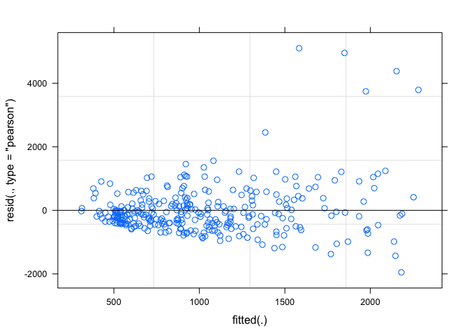

``` r
qqmath(step_mem_sap) # this is ok
```

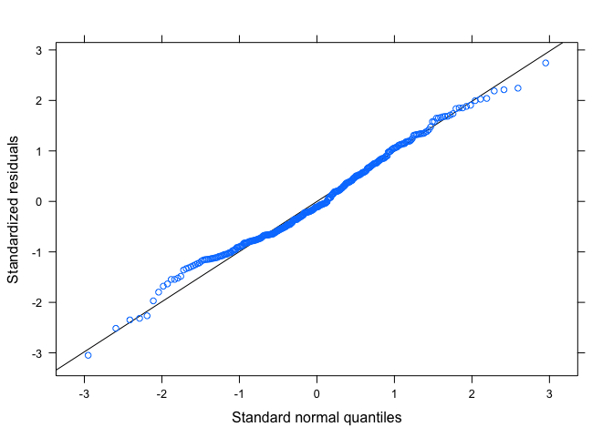

``` r
#try with untransformed amfs
full_ut_amf <- lmer(AMF ~ logP * pH.water * log(MAP) + (1|Plot), data = meta_counts_rmna)
step(full_ut_amf)
```

    ## Backward reduced random-effect table:
    ## 
    ##            Eliminated npar  logLik    AIC   LRT Df Pr(>Chisq)   
    ## <none>                  10 -2166.3 4352.6                       
    ## (1 | Plot)          0    9 -2170.6 4359.2 8.606  1   0.003351 **
    ## ---
    ## Signif. codes:  0 '***' 0.001 '**' 0.01 '*' 0.05 '.' 0.1 ' ' 1
    ## 
    ## Backward reduced fixed-effect table:
    ## Degrees of freedom method: Satterthwaite 
    ## 
    ##                        Eliminated Sum Sq Mean Sq NumDF   DenDF F value  Pr(>F)
    ## logP:pH.water:log(MAP)          1 117629  117629     1 279.811  1.9817 0.16033
    ## pH.water:log(MAP)               2   5197    5197     1 133.590  0.0879 0.76731
    ## logP:log(MAP)                   3 161358  161358     1 170.000  2.7269 0.10052
    ## log(MAP)                        4 178098  178098     1  36.283  2.9770 0.09296
    ## logP:pH.water                   0 245757  245757     1 195.008  4.0485 0.04559
    ##                         
    ## logP:pH.water:log(MAP)  
    ## pH.water:log(MAP)       
    ## logP:log(MAP)           
    ## log(MAP)               .
    ## logP:pH.water          *
    ## ---
    ## Signif. codes:  0 '***' 0.001 '**' 0.01 '*' 0.05 '.' 0.1 ' ' 1
    ## 
    ## Model found:
    ## AMF ~ logP + pH.water + (1 | Plot) + logP:pH.water

``` r
step_ut_amf <- lmer(AMF ~ logP + pH.water + logP:pH.water + (1 | Plot), data = meta_counts_rmna)
summary(step_ut_amf)
```

    ## Linear mixed model fit by REML. t-tests use Satterthwaite's method [
    ## lmerModLmerTest]
    ## Formula: AMF ~ logP + pH.water + logP:pH.water + (1 | Plot)
    ##    Data: meta_counts_rmna
    ## 
    ## REML criterion at convergence: 4384.3
    ## 
    ## Scaled residuals: 
    ##     Min      1Q  Median      3Q     Max 
    ## -1.7281 -0.5491 -0.2421  0.2553  5.9585 
    ## 
    ## Random effects:
    ##  Groups   Name        Variance Std.Dev.
    ##  Plot     (Intercept) 12210    110.5   
    ##  Residual             60703    246.4   
    ## Number of obs: 316, groups:  Plot, 56
    ## 
    ## Fixed effects:
    ##               Estimate Std. Error      df t value Pr(>|t|)    
    ## (Intercept)     517.88     126.15  107.19   4.105  7.9e-05 ***
    ## logP           -173.90      81.12  209.43  -2.144   0.0332 *  
    ## pH.water        -43.62      23.25  115.78  -1.876   0.0632 .  
    ## logP:pH.water    29.36      14.59  195.01   2.012   0.0456 *  
    ## ---
    ## Signif. codes:  0 '***' 0.001 '**' 0.01 '*' 0.05 '.' 0.1 ' ' 1
    ## 
    ## Correlation of Fixed Effects:
    ##             (Intr) logP   pH.wtr
    ## logP        -0.268              
    ## pH.water    -0.984  0.335       
    ## logP:pH.wtr  0.346 -0.986 -0.416

``` r
anova(step_mem_amf, step_ut_amf)
```

    ## Data: meta_counts_rmna
    ## Models:
    ## step_ut_amf: AMF ~ logP + pH.water + logP:pH.water + (1 | Plot)
    ## step_mem_amf: AMF_trans ~ logP + pH.water + log(MAP) + logP:pH.water + logP:log(MAP) + 
    ## step_mem_amf:     (1 | Plot)
    ##              npar    AIC    BIC   logLik deviance  Chisq Df Pr(>Chisq)    
    ## step_ut_amf     6 4426.0 4448.5 -2207.01   4414.0                         
    ## step_mem_amf    8  816.1  846.2  -400.07    800.1 3613.9  2  < 2.2e-16 ***
    ## ---
    ## Signif. codes:  0 '***' 0.001 '**' 0.01 '*' 0.05 '.' 0.1 ' ' 1

``` r
# want to use transformed based on AIC

# look at diagnostic plots
plot(step_ut_amf) # fanning again
```

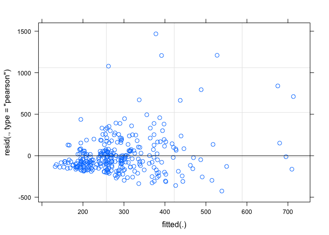

``` r
qqmath(step_mem_amf)
```

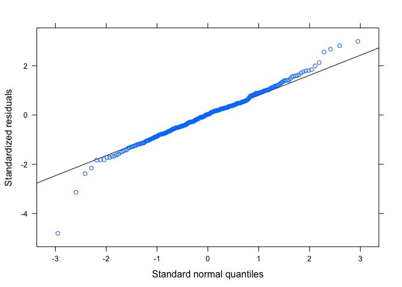

``` r
#will use transformed responses
```
